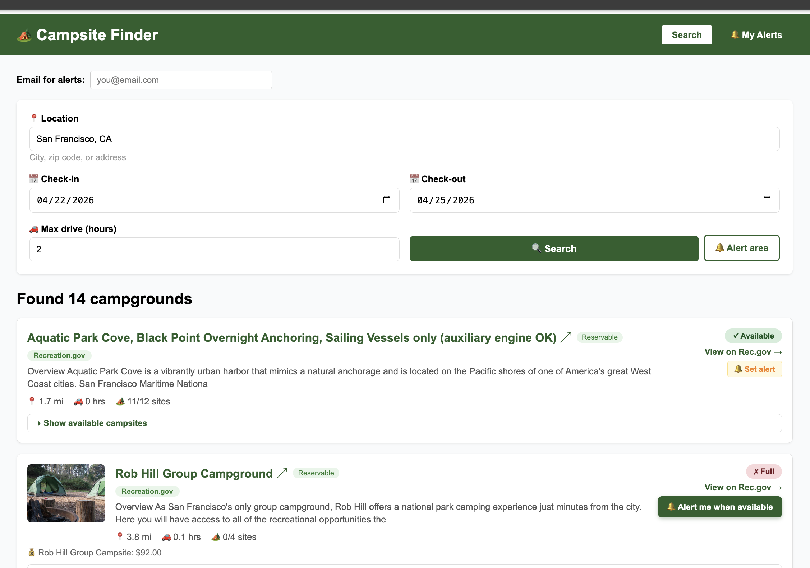
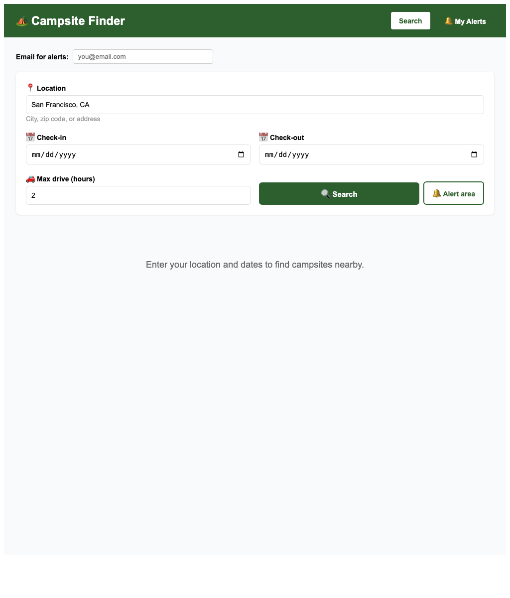
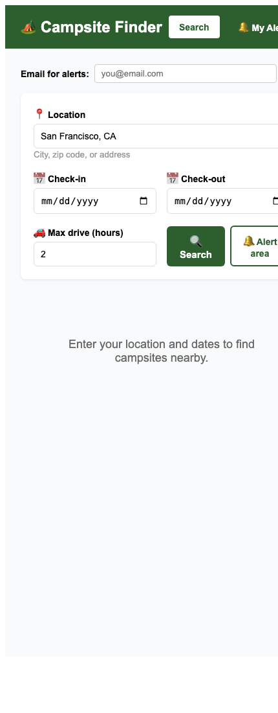

# Campsite Booking

### Find nearby campgrounds, inspect availability, and set alerts before the best sites disappear.

Campsite Booking is a California-first campsite discovery app built with a Next.js frontend and a FastAPI backend. It helps you search from a real starting location, compare campground options across providers, drill into site-level availability, and create email alerts for specific campgrounds or broader search areas.

<p align="center">
	<a href="#screenshots">Screenshots</a> •
	<a href="#features">Features</a> •
	<a href="#how-it-works">How It Works</a> •
	<a href="#getting-started">Getting Started</a> •
	<a href="#project-structure">Project Structure</a>
</p>

<p align="center">
	
	
	
	
	
</p>

## Why This App?

Campground planning usually means jumping between provider websites, checking dates manually, and revisiting full campgrounds to see whether anything opens up later. This project brings those steps into one workflow:

- Search from a city, ZIP code, or address instead of browsing provider sites one by one.
- Filter by practical driving time, not just map distance.
- See campground-level and site-level availability when provider data is available.
- Save alerts for a single campground or a whole area and let the backend keep checking for you.

## Screenshots

The screenshots below are captured from the current app in this repository.

| Desktop | Tablet |
| --- | --- |
|  |  |

| Mobile |
| --- |
|  |

## Features

### Search and discovery

- Search for campgrounds near a city, ZIP code, or address.
- Use location autocomplete to reduce geocoding mistakes.
- Filter results by maximum driving time from your chosen starting point.
- Sort results by proximity.
- See provider, distance, drive time, and availability summary in one place.

### Availability checking

- Check date-based campground availability for reservable campgrounds.
- Expand many campgrounds into individual campsite rows.
- Review site name, loop, type, max people, and stay coverage.
- Surface available versus total sites for the requested trip window.

### Alerts and monitoring

- Create an alert for one specific campground.
- Create an area alert for all campgrounds matching your search radius.
- View saved alerts by email address.
- Track active status, notification count, and last checked timestamp.
- Delete alerts you no longer want monitored.

### Multi-provider coverage

- Recreation.gov via RIDB for facility discovery.
- National Park Service data for enrichment like descriptions, imagery, amenities, and fees.
- ReserveCalifornia support for California state parks.
- Mock search fallback so the app can still run locally without every external key.

## What You Can Achieve

Use the app to solve real planning questions such as:

- Which campgrounds are within 2 to 4 hours of San Francisco?
- Which campgrounds still have reservable inventory for a specific weekend?
- Which exact sites are open inside a campground, not just whether the campground is generally full?
- Which full campgrounds should email you if availability opens later?
- Which nearby areas should stay under watch while you keep plans flexible?

## How It Works

1. Enter a location, trip dates, and a max driving time.
2. The backend geocodes the location and queries supported providers in parallel.
3. Results are merged, de-duplicated where possible, and filtered by drive-time radius.
4. Reservable campgrounds can be checked for trip-specific availability.
5. You can expand supported campgrounds to inspect individual campsite details.
6. You can create alerts that the backend checks every 30 minutes.

## Getting Started

### 1. Clone the project

```bash
git clone https://github.com/monikad/campsite-booking.git
cd campsite-booking
```

### 2. Configure the backend environment

The backend reads settings from `backend/.env`.

```bash
cd backend
python3 -m venv .venv
source .venv/bin/activate
pip install -r requirements.txt
cp .env.example .env
```

Then fill in the values you want to use in `backend/.env`.

Required for the full search experience:

- `RIDB_API_KEY`

Optional but useful:

- `NPS_API_KEY`
- `SMTP_HOST`
- `SMTP_PORT`
- `SMTP_USER`
- `SMTP_PASSWORD`
- `ALERT_FROM_EMAIL`

If provider keys are missing, the app can still run with local mock campground results.

### 3. Start the backend

```bash
cd backend
source .venv/bin/activate
uvicorn app.main:app --reload --port 8010
```

### 4. Start the frontend

```bash
cd web
npm install
npm run dev
```

### 5. Open the app

- Frontend: `http://localhost:3000`
- Backend API: `http://localhost:8010`

## Using the App

1. Enter your email if you plan to create alerts.
2. Pick a location, check-in date, check-out date, and max drive time.
3. Run a search.
4. Open matching campgrounds in the results list.
5. Expand supported results to inspect site-level availability.
6. Create either a campground alert or an area alert.
7. Use the My Alerts tab to review or delete saved alerts.

## API Surface

Primary local endpoints:

- `GET /health`
- `GET /autocomplete`
- `GET /search`
- `GET /availability/{facility_id}`
- `POST /alerts`
- `GET /alerts`
- `DELETE /alerts/{id}`

Base local API URL:

- `http://localhost:8010`

## Project Structure

```text
campsite-booking/
├── README.md
├── ridb.yaml
├── assets/
│   └── screenshots/
├── backend/
│   ├── app/
│   │   ├── alerts.py
│   │   ├── availability.py
│   │   ├── database.py
│   │   ├── main.py
│   │   ├── nps_client.py
│   │   ├── reserve_california.py
│   │   └── ridb_client.py
│   ├── .env.example
│   └── requirements.txt
└── web/
    ├── package.json
    └── pages/
        └── index.js
```

## Stack

- Next.js and React for the frontend
- FastAPI for the backend API
- SQLite for local alert storage
- Nominatim geocoding for location lookup
- RIDB, NPS, and ReserveCalifornia integrations

## Current Notes

- The current product direction is California-first, especially because ReserveCalifornia support is included.
- Site-level availability depends on provider support and campground mapping quality.
- Email alerts require SMTP configuration in `backend/.env`.
- The screenshots in this README currently show the search experience and responsive layout.

## Future Improvements

- Stronger ranking and filtering across providers
- More resilient alert delivery and retry behavior
- Better cross-provider normalization
- Hosted database and deployment workflow
- User accounts and saved trip preferences
